[back](./)

## Events

| | |
|-|-|
| 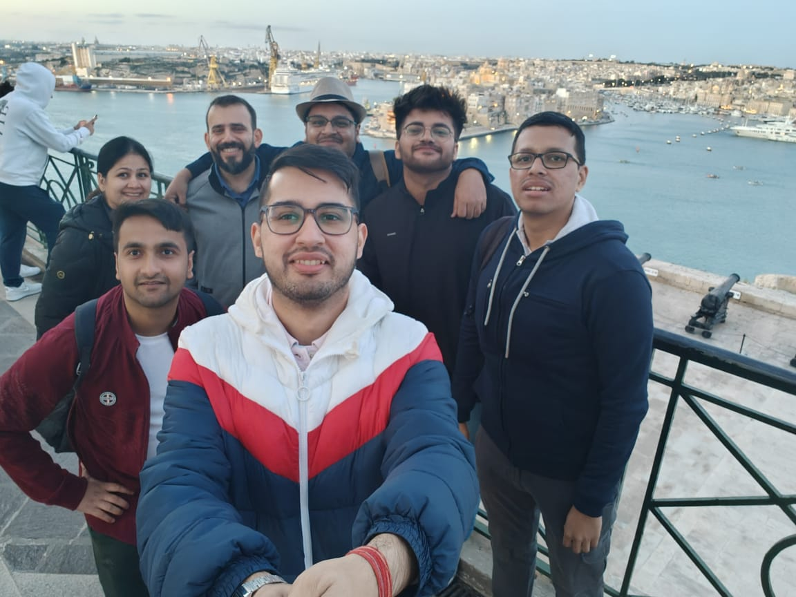 In Valetta (Malta) with Prachi Jain (Microsoft), Tanmay (Microsoft), Aayush Agrawal (Microsoft), Rishav (Microsoft), Cem (MEU), and Ashutosh (IIT Bombay). | 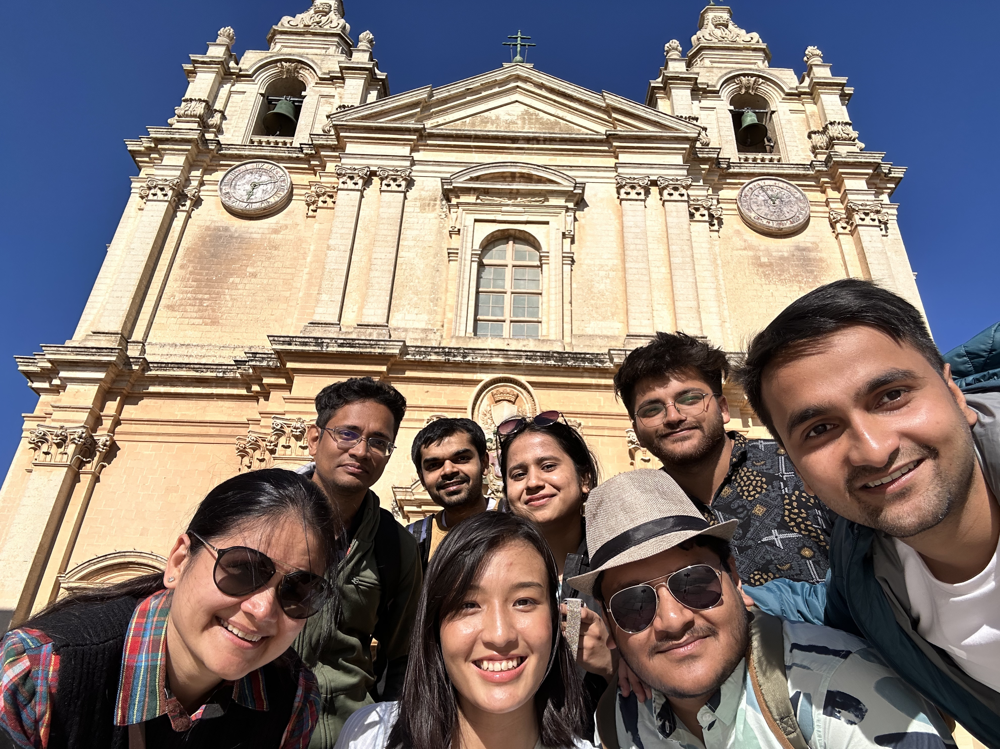  With Prachi, Tanmay, Aayush, Aditi (Microsoft), Jennifer (CMU), Siddharth (Amazon), and Rohith (ambientone) in Mdina (Malta). |
|  With Tanmay, Siddharth, Jennifer, and Aayush in Mdina (Malta). | 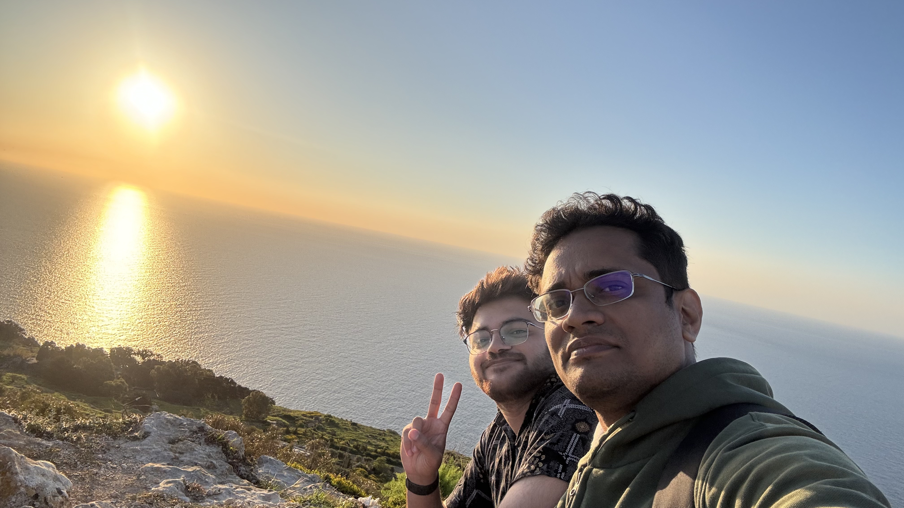 With Rohith Kodali sitting at the edge of Dingli Cliff (Malta). |
| 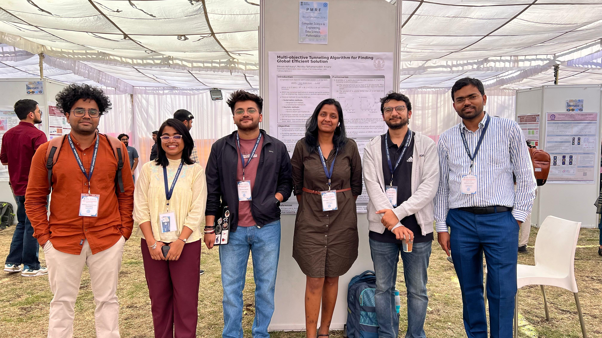 With PMRF CSE friends at the PMRF Symposium 2024 at IIT Indore. Had a great poster session! :) | 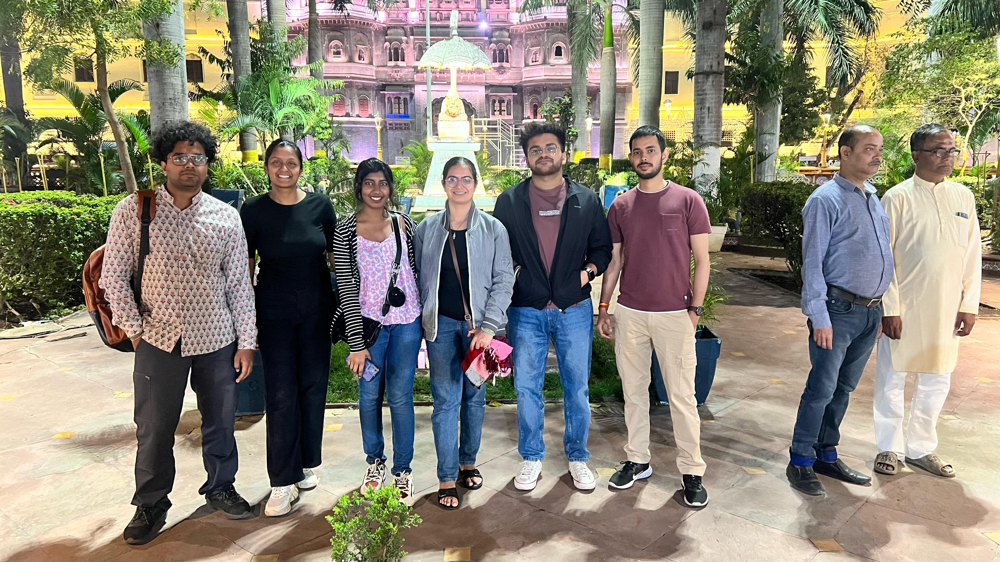 With IIT Jodhpur friends visiting Sarafa Market late night in Indore!  |
| 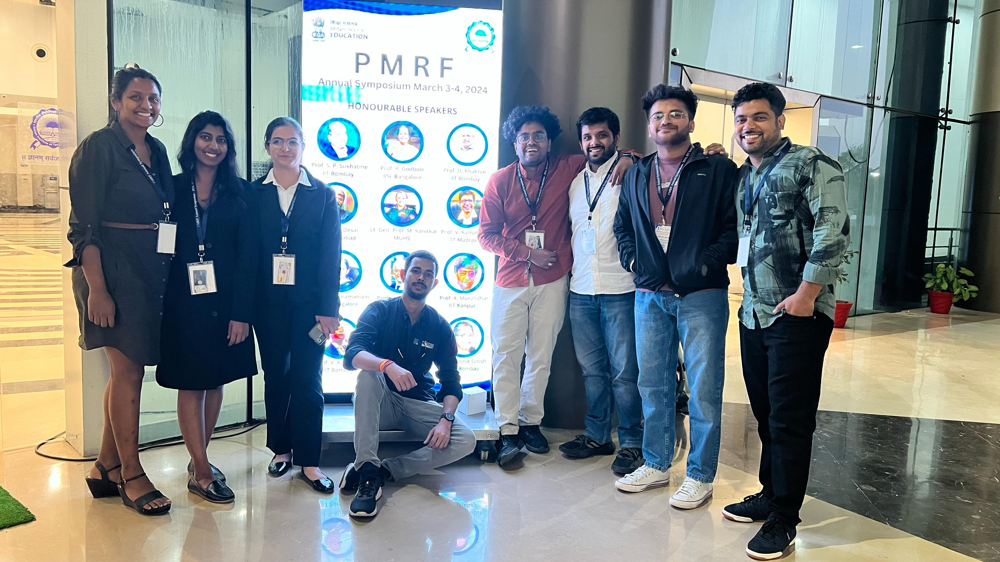 With PMRF friends after the PMRF Symposium was over! :') | 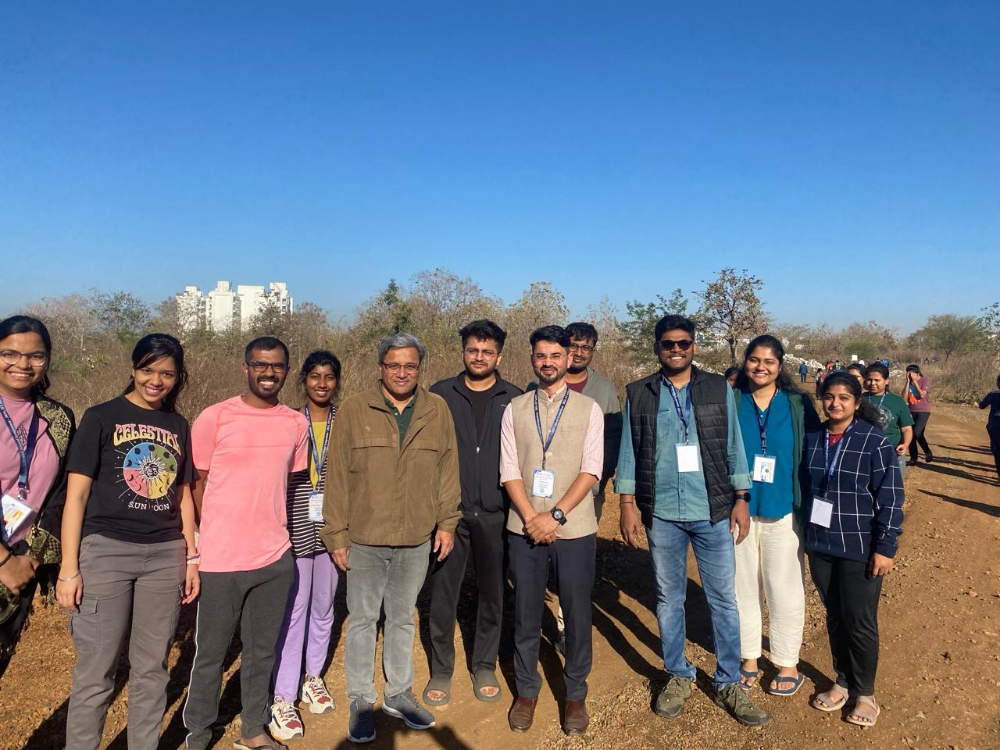 Bunch of PMRFs with the director of IIT Indore during the morning jungle walk.   |
| 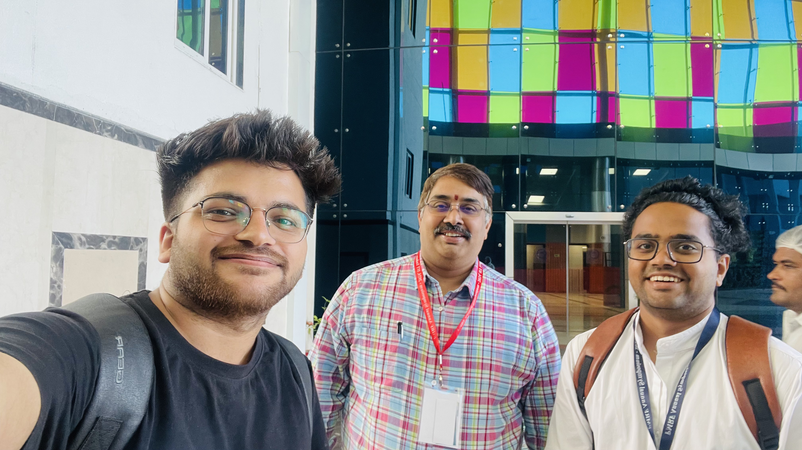 With Prof. Ganti S. Murthy (IIT Indore) and Abhiram (IIT Jodhpur) during the PMRF Symposium 2024 | 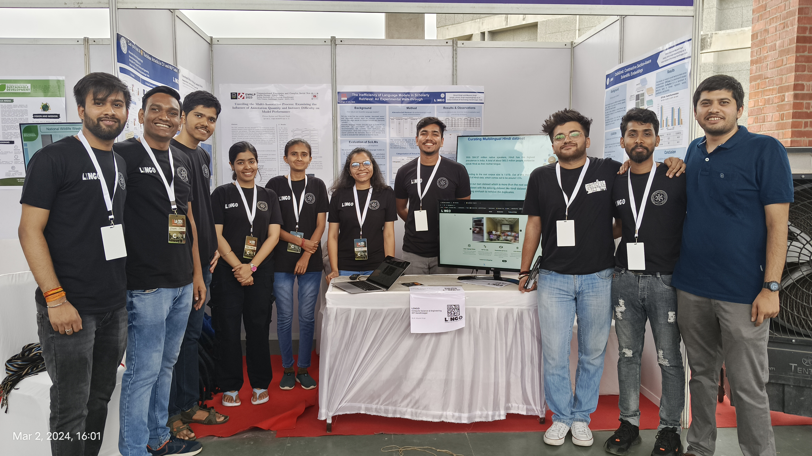 Lingo members showcasing their amazing works at the Colab Event 2024 at IIT Gandhinagar.   |
| 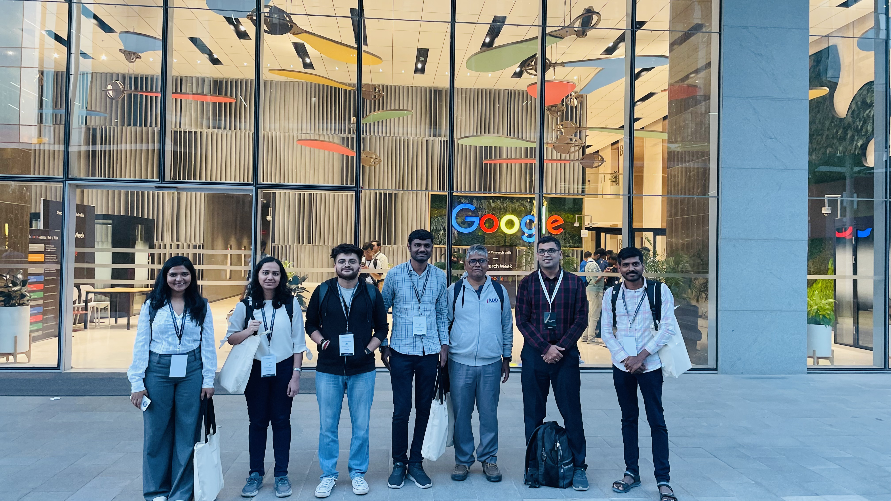 Prof. Anirban, Prof. Nipun, Shruti, Jayesh, Zeel, Binita, and Himanshu attended the 'Research Week with Google 2024' at Google Research India, Bangalore, India. | 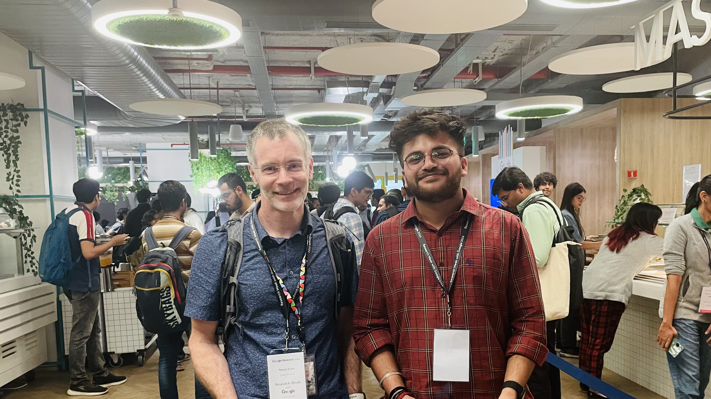 Was fortunate to meet one of my motivations at Research Week with Google 2024, Prof. Trevor Cohn (Uo Melbourne and Google) himself!   |

---

[back](./)
