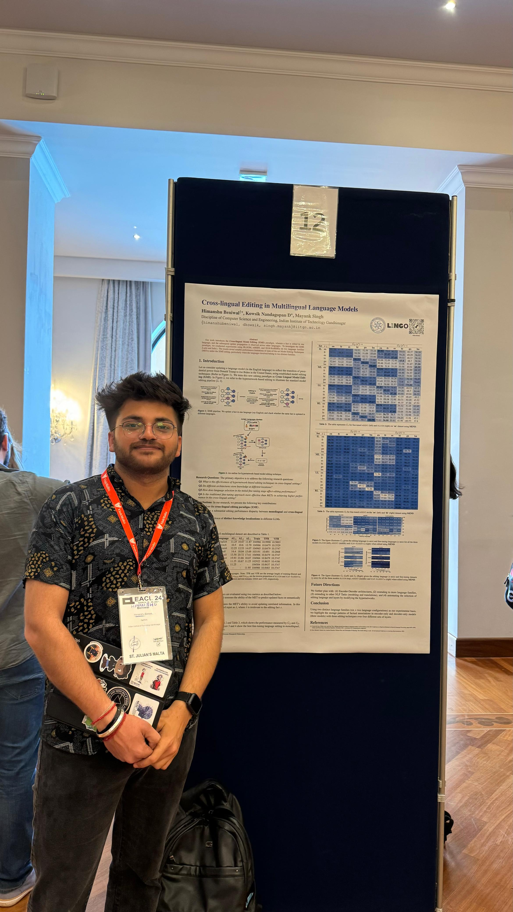
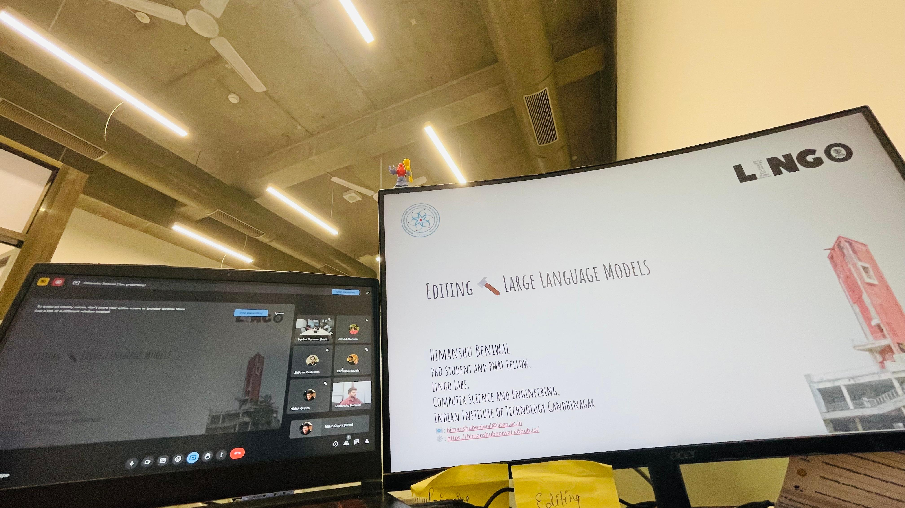
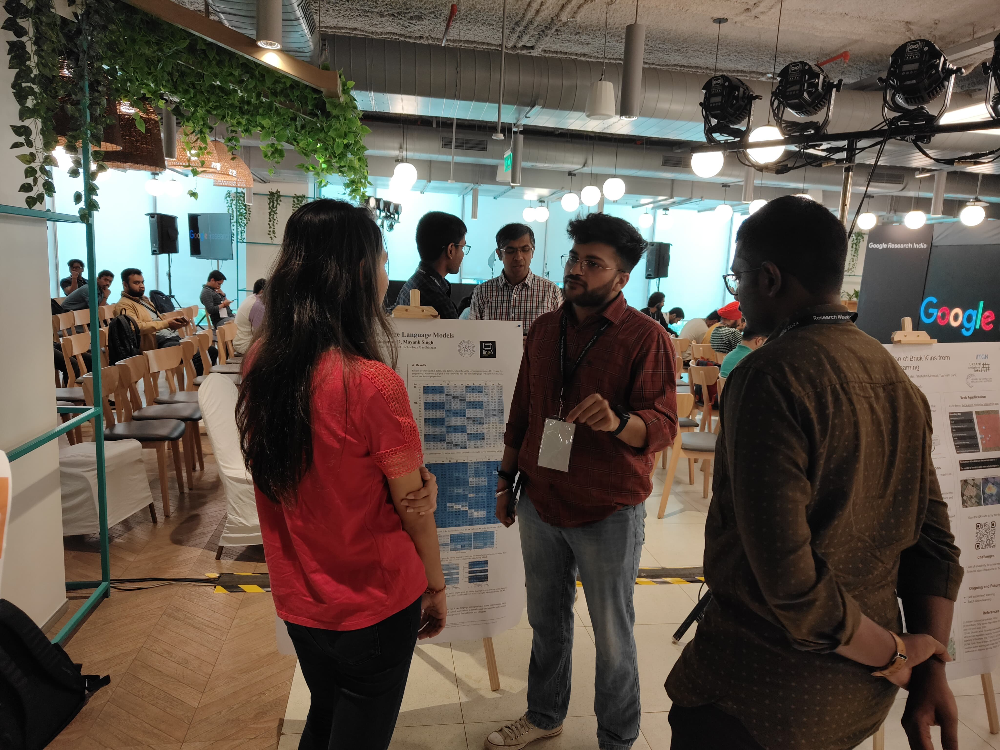
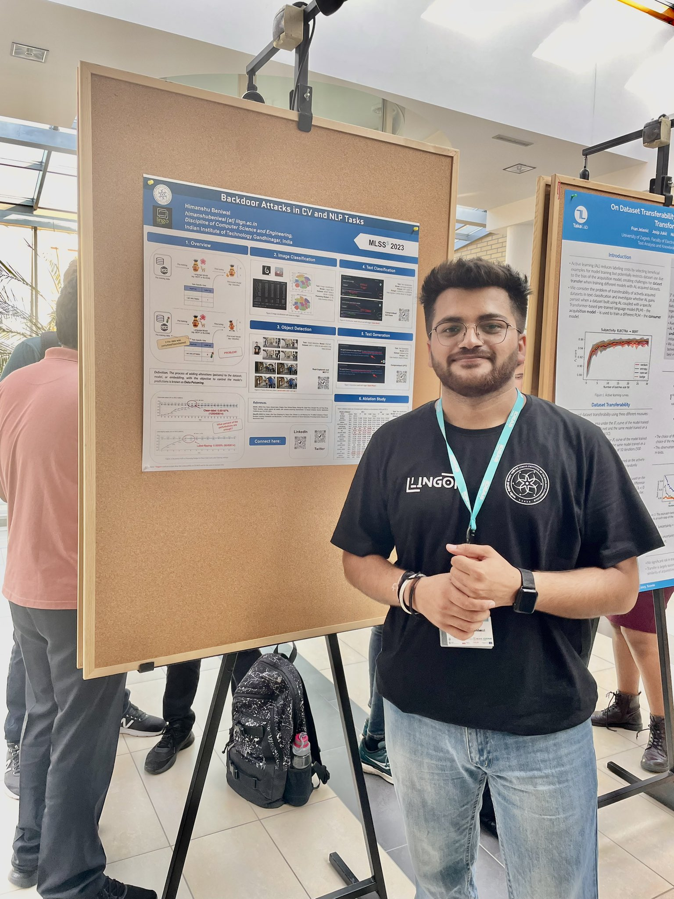

[back](./)

## Posters / Talks

| | |
|-|-|
|  | **EACL 2024**     Presented our "Cross-lingual Editing in Multilingual Language Models" at EACL 2024, Malta! 🚀  |
| **PMRF Symposium 2024**     Attended and presented a poster on "Cross-lingual Model Editing" at the PMRF Symposium 2024, held at IIT Indore! 🌟 | | 
|  | **Google Research India, 2024**     Gave a talk on "Editing Large Language Models" at Google Research India, Bangalore! 🤩  |
| **Google Research Week, 2024**     Presented our "Cross-lingual Model Editing" work at the Research Week with Google, @Google Research India, Bangalore! 😁 |  |
|  | **MLSS, 2023**     Attended and presented a poster on "Backdoor Attacks in NLP and CV Tasks" at the Machine Learning Summer School (MLSS) 2023, held at Krakow, Poland!!! 😎  |
