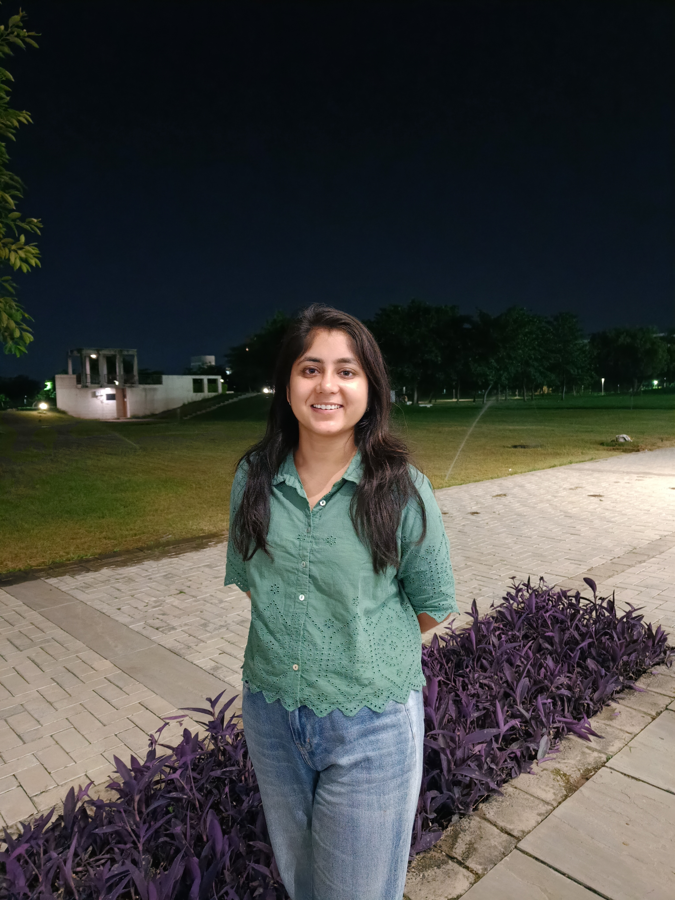
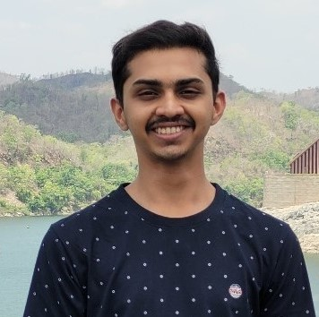
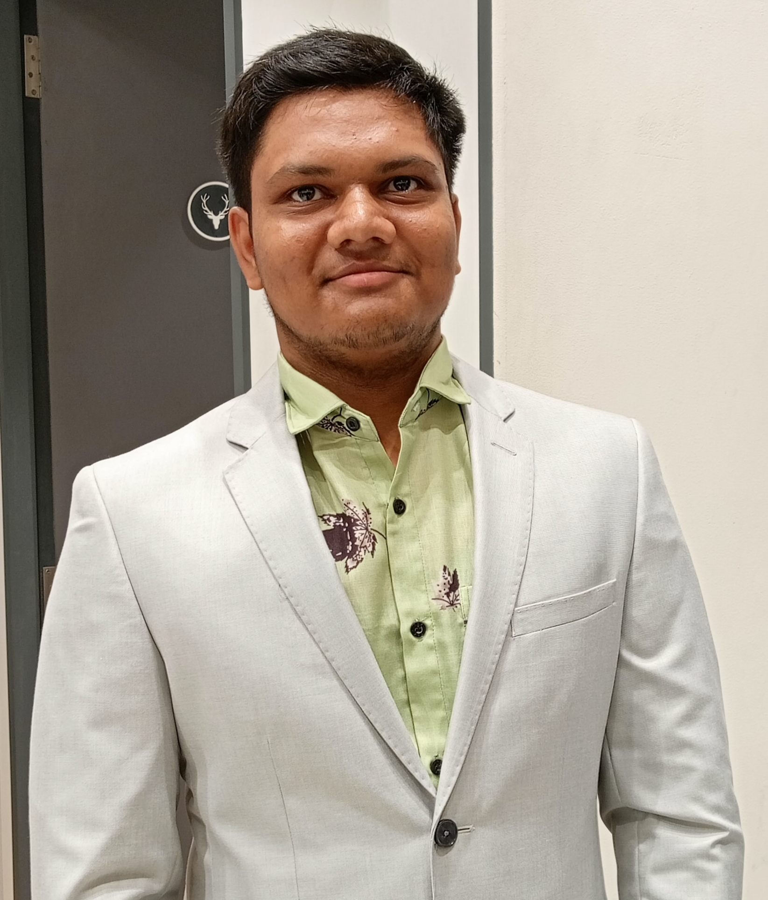

[back](./)

## Team

| | |
|-|-|
|  | **Rajdeep Singh Devra**   _Club Secretary_     Founded Anveshanam Club to bridge gaps, offer guidance, and create a community for shared academic experiences. As Club Secretary, my vision is to cultivate a research community at IITGN dedicated to continuous learning and exploration. Join us in shaping the future of research! 🚀  |
| **Himanshu Beniwal**   _Web Development Team_     Learning, contributing to the community, and making lifelong connections were the main reasons to join the club! Membership provides an opportunity to glean insights from the experiences of others, encompassing both successes and failures, thereby enriching our own educational pursuits. 🌟 | | 
|  | **Muskan Jindal**   _Editorial Team_     Provides leadership experience, student institutional involvement, social enrichment, collaboration, and peer accountability in addition to research training. |
| **N S Ramanathan**   _Outreach Coordinator_     Inculcate technical skill sets, showcase leadership and get involved in management, coordination and smooth execution of events, collaboration and development of social connections. | | 
|  | **Harsh Jaitwal**   _Social Media Team_     I have associated with Anveshanam last 2 years and have worked as a part of the Social media curator team. I got somehow best learnings and experiences and also learnt many new things in the social media marketing domain.  |
