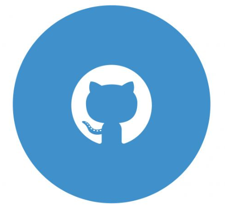
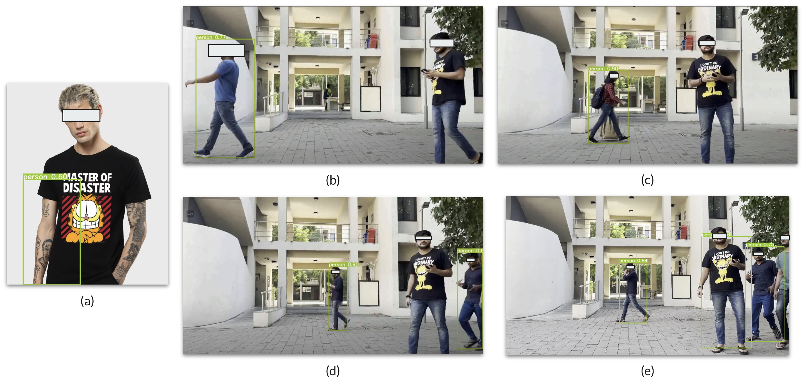

|   |   |  | [Posters / Talks 🤩](./another-page4.html) |  [Some beautiful memories! 🥹](./memories.html) |

## About Me 🫡

I am a **Ph.D. student** and **Prime Minister's Research Fellow (PMRF)** in the Computer Science and Engineering discipline at [**IIT Gandhinagar**](https://iitgn.ac.in/), where [Prof. Mayank Singh](https://mayank4490.github.io/) advises me. My area of interest includes **Robust and Interpretable NLP**. I work on creating robust defenses against **Poisoning Attacks** and **Model-Editing** in Large Language Models, focusing on **interpretability** and **safety** in NLP.

#### More about me! 💭

- 🔭 I’m currently working on <b>how an AI reads & understand the language! 🤖</b>
- 🌏 Flags Collected: 🇮🇳🇵🇱🇨🇿🇦🇹🇸🇰🇫🇷🇮🇹🇲🇹🇹🇭🇺🇸🇹🇷🇲🇾
- 📫 Socials: [LinkedIn 👨🏼‍💼](https://www.linkedin.com/in/himanshubeniwal/), [Twitter 🐤](https://twitter.com/HimanshuBeniwaI), [Hugging-Face 🤗](https://huggingface.co/himanshubeniwal)
- 📸 Travel Pics: <a href="https://www.instagram.com/himanshubeniwal_/"> Instagram </a>
- 😄 Fav mathematical equation: The magic of Euler's Identity; $$e^{i \pi} + 1 = 0$$
- ⚡ Fun fact: <b>Traveling the 🌎 with 🖤 for espresso ☕️ & crazy for 💻. </b>

----

## Research Interests 🤯

- **Natural Language Processing:** Robust and Interpretable NLP, Secure NLP, Model-Editing, Word Segmentation, and Conversational AI.
- **Machine Learning:** Adversarial Attacks, Poisoning Attacks, Data and Embedding Poisoning Attacks.

## Some things I know 😎
- _Programming_: Python, R, C
- _Web Technologies_: Javascript, Flask, ReactJS, Bootstrap
- _Libraries_: NLTK, OpenCV, PyTorch, Tensorflow, Transformers, ElasticSearch, Flair, Trankit, TextAttack, SeqAttack

## News 🔊
- **[March 2025]** Attending [Advanced Language Processing School (ALPS) 2025](https://lig-alps.imag.fr/) at the beautiful Centre CNRS Paul Langevin, Aussois, France! 🇫🇷
- **[March 2025]** Talk on "_GenAI in HealthCare_", at [Google Developer Group - Silver Oak University](https://gdg.community.dev/events/details/google-gdg-on-campus-silver-oak-university-ahmedabad-india-presents-the-next-frontier-ai-in-healthcare/), Ahmedabad, India 🇮🇳!! 
- **[March 2025]** Attended [PMRF Symposium 2025](https://www.pmrf.in/) at IIT Hyderabad, India 🇮🇳!
- **[Feb 2025]** Welcome the [UnityAI-Guard 😵‍💫](https://lingo.iitgn.ac.in/unityai-guard/) to the world 🌎!
- **[Feb 2025]** [Char-mander 🔥](https://arxiv.org/abs/2502.16901), "_A Study of Cross-lingual Backdoor Attacks in Multilingual LLMs_", is now on ArXiv 🕸️! 
- **[Feb 2025]** Attended [Pingala Interactions in Computing (PIC) 2025](https://event.india.acm.org/pic/home/) at the fabulous Mysore campus of Infosys, India! 🇮🇳
- **[Jan 2025]** Attended [Google DeepMind Research Symposium 2025](https://rsvp.withgoogle.com/events/researchsymposium25) at Google Office, Bangalore, India! 🇮🇳
- **[Sept 2024]** [TempUN](https://github.com/lingoiitgn/TempUN), [PythonSaga](https://arxiv.org/abs/2401.03855), and [COMMENTATOR](https://arxiv.org/abs/2408.03125) made it to EMNLP 24' 🇺🇸! 🏝️
- **[Aug 2024]** Talk on "[Editing Large Language Models](https://x.com/MilaNLProc/status/1834180550107537637)", MilaNLP, Italy! 🇮🇹
- **[Aug 2024]** Visiting the [University of Virginia](https://www.virginia.edu/) (🇺🇸) with [Prof. Tom Hartvigsen](https://www.tomhartvigsen.com/)!! Super excited to work on _Interpretable + Multilingual NLP_! 🤯🤯🤯 
- **[Aug 2024]** Attended [ACL 2024](https://2024.aclweb.org/) at Bangkok, Thailand! 🇹🇭
- **[July 2024]** Released the [**Ganga-1B**](https://huggingface.co/LingoIITGN/ganga-1b) model! The Ganga-1B model outperforms existing open-source models that support **Indian languages**, even at sizes of up to **7 billion parameters**.
- **[June 2024]** Gave a talk at [ACM Summer School on Generative AI for Text](https://labs.iitgn.ac.in/lingo/acmsummerschool2024/) on "_Instruction fine-tuning, FLAN-T5, and Quantisation_"! 🤯 ([Recording](https://youtu.be/W9zdi2hMqyo))
- **[June 2024]** Gave a talk at India-ML Reading Group on "Editing LLMs"! 🤩 ([Recording](https://youtu.be/g38gQ8ykUSw))
- **[March 2024]** XME Made it to [EACL 2024](https://2024.eacl.org/), March 17-22, 2024, at St. Julian's, Malta! 🇲🇹
- **[March 2024]** Gave a talk on "Editing Large Language Models" at Google Research India, Bangalore, India!! 🇮🇳
- **[March 2024]** Attended [PMRF Symposium 2024](https://www.pmrf.in/symposium-2024), March 3-4, 2024, at IIT Indore, India.
- **[Feb 2024]** Attended [Research Week with Google 2024](https://sites.google.com/view/researchweek24/home), Feb 1-3, 2024, at Bengaluru, India.
- **[Jan 2024]** [XME](https://arxiv.org/abs/2401.10521) is now on ArXiv 🕸️! 
- **[Dec 2023]** [Gandhipedia](https://gandhipedia150.in/), a project of National Importance by joint initiative of IIT Kharagpur, IIT Gandhinagar, and NCSM (Kolkata), under the aegis of The Ministry of Culture, Government of India, was launched! 📢📢📢
- **[Dec 2023]** Served as Publicity Chair for [IndoML 2023](https://indoml.in/) at IIT Bombay.
- **[Sept 2023]** Attended [Technology & Bharatiya Bhasha Summit](https://technology-bharatiyabhasha.aicte-india.org/), Sept 30 - Oct 01, 2023, New Delhi, India! 🇮🇳
- **[July 2023]** Attended [Deep Learning and Artificial Intelligence Summer/Winter School 2023 (DLAI7)](https://deeplearningandaiwinterschool.github.io/), 17 - 21 July 2023.
- **[May 2023]** Attended [MLSS 2023](https://mlss2023.mlinpl.org/) at Krakow, Poland! 🇵🇱
- **[April 2023]** Done with Ph.D. Thesis Proposal Defense! 😊✅
- **[Feb 2023]** Attended [ARCS 2023](https://event.india.acm.org/ARCS/) and [ACM Annual Event 2023](https://event.india.acm.org/annualevent/) at OIST Bhopal, India. 
- **[Jan 2023]** Attended [Research Week with Google 2023](https://sites.google.com/view/researchweek2023/home) at Bengaluru, India. 
- **[Jan 2023]** Attended [CODS-COMAD 2023](https://cods-comad.in/) at IIT Bombay, India. 
- **[Dec 2022]** Done with PhD Qualifiying Examinations! 😄🕺🏻
- **[Oct 2022]** Got selected as a Prime Minister's Research Fellow ([PMRF](https://www.pmrf.in/)). 📢📢
- **[Aug 2022]** Attended [Oxford Machine Learning Summer School (OxML) 2022](https://www.oxfordml.school/oxml2022). 
- **[July 2022]** Attended [Eastern European Machine Learning Summer School (EEML) 2022](https://www.eeml.eu/home).
- **[Feb 2022]** Attended [Research Week with Google 2022](https://sites.google.com/view/researchweek2022).
- **[Jan 2022]** Attended [Advanced Language Processing Winter School (ALPS) 2022](http://alps-2022.imag.fr/index.php/speakers/index.html). 
- **[August 2021]** Started doctoral journey with [Prof. Mayank Singh](https://mayank4490.github.io/) at [Computational Linguistics and Complex Social Networks Group](https://labs.iitgn.ac.in/lingo/). 📢📢📢

## Education 👨🏻‍🎓

- **[Indian Institute of Technology Gandhinagar](https://iitgn.ac.in/)**
   
  _Doctor of Philosophy_ in _Computer Science and Engineering_, 2021 - Present
   
  Thesis: Defending and Editing Large Language Models
- **[Central University of Punjab](http://cup.edu.in/)**
   
  _Master of Technology_ in _Computer Science and Technology_, 2019 - 2021, _Rank: 1 (Gold Medalist)_
   
  Thesis: Assessing Empathetic Capabilities in Conversational Approaches
- **[Hemvati Nandan Bahuguna Garhwal University (A Central University)](https://www.hnbgu.ac.in/home)**
   
  _Bachelor of Technology_ in _Computer Science and Engineering_, 2015 - 2019, _Rank: 1_
   
  Thesis: Vehicle simulation using Q-Learning and vehicle control in CARLA

## Publications (Citations: 💯) 📚
- **Char-mander Use mBackdoor! A Study of Cross-lingual Backdoor Attacks in Multilingual LLMs**
   
  **Himanshu Beniwal**, Sailesh Panda, Mayank Singh
   **ArXiv 2025**
   
  [[PDF](https://arxiv.org/abs/2502.16901)]
  
- **COMMENTATOR: A Code-mixed Multilingual Text Annotation Framework**
   
  Rajvee Sheth, Shubh Nisar, Heenaben Prajapati, **Himanshu Beniwal**, Mayank Singh
   **EMNLP DEMO 2024 (Core Rank: A\*)**
   
  [[PDF](https://arxiv.org/abs/2408.03125)] | [[Website 🕸️](https://lingo.iitgn.ac.in/codemixing/)]

- **PythonSaga: Redefining the Benchmark to Evaluate Code Generating LLMs**
   
  Ankit Yadav, **Himanshu Beniwal**, Mayank Singh
   **EMNLP 2024 (Core Rank: A\*)**
   
  [[PDF](https://arxiv.org/abs/2401.03855)] 

- **Remember This Event That Year? 🤔 Assessing Temporal Information and Reasoning in Large Language Models**
   
  **Himanshu Beniwal**, Dishant Patel, Kowsik Nandagopan D, Hritik Ladia, Ankit Yadav, Mayank Singh
   **EMNLP 2024 (Core Rank: A\*)**
   
  [[PDF](https://arxiv.org/abs/2402.11997)] | [[Website 🤔](./TempUN/TempUN.html)]

- **Cross-lingual Editing in Multilingual Language Models**
   
  **Himanshu Beniwal**, Kowsik Nandagopan D, Mayank Singh
   Findings of the Association for Computational Linguistics: **EACL 2024** **(Core Rank: A)**
   
  [[PDF](https://arxiv.org/abs/2401.10521)] | [[Website 🕸️](./XME/XME.html)]

- **A survey on near-human conversational agents**
   
  Satwinder Singh, **Himanshu Beniwal**
   
  Journal of King Saud University - Computer and Information Sciences, 1319-1578, 2021. **JKSU-CIS 2021**.
   
  [[PDF](https://doi.org/10.1016/j.jksuci.2021.10.013)] | _IF: 13.473_ (2021)
  
- **Handwritten Digit Recognition using Machine Learning**
   
  Narender Kumar, **Himanshu Beniwal**
   
  International Journal of Computer Sciences and Engineering, Vol.06, Issue.05, pp.96-100, 2018. **IJCSE 2018**.
   
  [[PDF](https://www.ijcseonline.org/full_spl_paper_view.php?paper_id=429)] | _IF: 3.218_ (2018) 

## Posters/Talks 🔊
- **[Sept 2024]** Talk on "Editing Large Language Models", MilaNLP, Italy! 🇮🇹
- **[March 2024]** Talk on "Editing Large Language Models", Google Research India, Bangalore, India.
- **[March 2024]** [PMRF Symposium 2024](https://www.pmrf.in/symposium-2024), "Cross-lingual Editing in Multilingual Language Models", at IIT Indore.
- **[Feb 2024]** [Research Week with Google **2024**] at Google Research India, Bangalore, India, on *'XME: Cross-lingual Model Editing in LLMs'*.
- **[January 2024]** [PhD Research Showcase **2024**] at IIT Gandhinagar, India, on *'Temporal Learnings in LLMs'*.
- **[August 2023]** [PhD Research Showcase **2023**] at IIT Gandhinagar, India, on *'XME: Cross-lingual Model Editing in LLMs'*.
- **[June 2023]** [MLSS^S 2023] in Krakow, Poland 🇵🇱, on [*'Backdoor Attacks in CV and NLP'*](https://github.com/himanshubeniwal/himanshubeniwal.github.io/blob/main/assets/img/MLSS_S%20Poster-%20Himanshu.pdf).
- **[Feb 2023]** Talk on "Backdoor Attacks in NLP", at IISER Bhopal. 

## Community Experience 👷🏻‍♂️
- _Volunteer_: _Communications Team_ at [ACL Rolling Review](http://aclrollingreview.org/) (April 24' - Present).
- _Mentor_: _Research Mentor_ at [SimPPL](https://simppl.org/) (Jan 2024 - Present).
- _Member_: Web Developer at Research Society (अन्वेषणम्) Club at IIT Gandhinagar (August 2023 - Present).
- _Organizer_: [IndoML 2023](https://indoml.in/)
- _Volunteer_: [IndoML 2022](https://indoml.in/2022/), [ACM-IKDD Summer School 2022](https://labs.iitgn.ac.in/datascience/summer-school/)
- _Conference Reviewer_: [LREC-COLING 2024](https://lrec-coling-2024.org/), [EACL CASE 2024](https://emw.ku.edu.tr/case-2024/), [EACL Demo 2024](https://2024.eacl.org/calls/demos/), [EAI SaSeIoT 2023](https://securityiot.eai-conferences.org/2023/), [EMNLP 2023](https://2023.emnlp.org/), [ICTIR 2023](https://sigir.org/ictir2023/), [ACL Workshop BigScience 2022](https://openreview.net/group?id=aclweb.org/ACL/2022/Workshop/BigScience), [DLSM 2021](https://easychair.org/cfp/smda2021)
- _Journal Reviewer_: [ACI 2022](https://www.emeraldgrouppublishing.com/journal/aci)
- _Organized 20+ workshops/hackathons events._ [Pictures 📸](https://iitgnacin-my.sharepoint.com/:f:/g/personal/21310012_iitgn_ac_in/EhSrF8avznZLjhtDLDp0jP0BsKAGKYqw4aIIqDshBSL6Rg?e=BH8G4v)
- _Beta Reviewer_: Coursera
- _Mentor_: _Summer Internship Mentor_ at RightApprise 2018
- _Campus Representative/Ambassador_: Google Crowdsource 2019, GeeksforGeeks 2018-19, Internshala 2017-18
- _Scholar_: Udacity Facebook Scholar 2019, Google India Scholar 2018

## TA🛳️s
- _Dhirubhai Ambani Institute of Information and Communication Technology (DA-IICT)_
  - _IT549: Deep Learning_, +45 student, Jan 2025 to May 2025, with [Prof. Arpit Rana](https://www.daiict.ac.in/faculty-details/3407).
  - _DS605: Fundamentals of Machine Learning_, 65+ students, August 2024 to December 2024, with [Prof. Arpit Rana](https://www.daiict.ac.in/faculty-details/3407).
  - _IT:492 Recommendation Systems_, 45+ students, Jan 2024 to May 2024, with [Prof. Arpit Rana](https://www.daiict.ac.in/faculty-details/3407).
  - _IT:496 Introduction to Data Mining_, July 2023 to December 2023, with [Prof. Arpit Rana](https://www.daiict.ac.in/faculty-details/3407).
  - _IT:492 Recommendation Systems_, Jan to May 2023, with [Prof. Arpit Rana](https://www.daiict.ac.in/faculty-details/3407).

- _Indian Institute of Technology Gandhinagar_
  - [CS 203: Software Tools & Techniques for AI](https://sites.google.com/iitgn.ac.in/cs203-2025/home?pli=1&authuser=1), January 2025 to May 2025, with [Prof. Mayank Singh](https://mayank4490.github.io/).
  - _[CS:613 Natural Language Processing](https://sites.google.com/iitgn.ac.in/cs613-2024/home)_, August 2024 to December 2024, with [Prof. Mayank Singh](https://mayank4490.github.io/).
  - [__Graduate Teaching Fellow__] [Data Centric Computing](https://people.iitgn.ac.in/~gmanoj/DCC/), Jan 2024 to May 2024, with [Prof. Manoj Gupta](https://people.iitgn.ac.in/~gmanoj/) and [Prof. Mayank Singh](https://mayank4490.github.io/).
  - _[CS:613 Natural Language Processing](https://sites.google.com/iitgn.ac.in/cs613-2023/home)_, July 2023 to December 2023, with [Prof. Mayank Singh](https://mayank4490.github.io/).
  - _[ES:432 Databases](https://sites.google.com/iitgn.ac.in/c432-2023/home)_, Jan to May 2023, with [Prof. Mayank Singh](https://mayank4490.github.io/).
  - _[ACM-IKDD Summer School on Data Science](https://labs.iitgn.ac.in/datascience/summer-school/)_, July 4th – 16th, 2022.
  - _[ES:432 Databases](https://sites.google.com/iitgn.ac.in/cs-432-2022/home)_, Jan to May 2022, with [Prof. Mayank Singh](https://mayank4490.github.io/).
  - _[ES 102 - Introduction to Computing](https://nipunbatra.notion.site/nipunbatra/ES-102-Introduction-to-Computing-2021-Winter-5aa842ce18d34e0e9b2cc646b5325868)_, Nov to Dec 2021, with [Prof. Sairam Swaroop Mallajosyula](https://iitgn.ac.in/faculty/chemistry/fac-sairam) & [Prof. Nipun Batra](https://nipunbatra.github.io/).
  - _[ES:242 (Data Structure & Algorithms - 1)](https://people.iitgn.ac.in/~gmanoj/ES242-2021/)_, August to Nov. 2021, with [Prof. Manoj Gupta](https://people.iitgn.ac.in/~gmanoj/).
  
## 📰 Coverage
- **[Feb 2024]** Attended Research Week with Google 2024 at Google Research India, Bangalore, India. [Twitter](https://twitter.com/HimanshuBeniwaI/status/1753103925325201447).
- **[Dec 2023]** Gandhipedia launch! 😀 [ETV](https://www.etvbharat.com/bengali/west-bengal/state/kolkata/mahatma-gandhis-unknown-information-at-one-click-of-mouse-as-centre-launches-gandhipedia/wb20231227193836408408064), [ZeeNews](https://zeenews.india.com/bengali/kolkata/gandhipedia-ai-power-portal-on-mahatma-gandhi-by-kharagpur-iit-professor_501189.html), [Times of India](https://timesofindia.indiatimes.com/city/kolkata/ai-enabled-repository-on-gandhi-launched/articleshow/106334897.cms), [The States Man](https://www.thestatesman.com/bengal/ai-enabled-gandhipedia-for-better-social-connect-1503253844.html), and [ETV Bharat](https://www.etvbharat.com/bengali/west-bengal/state/kolkata/mahatma-gandhis-unknown-information-at-one-click-of-mouse-as-centre-launches-gandhipedia/wb20231227193836408408064).  
- **[Sept 2023]** [Twitter](https://twitter.com/lingoiitgn/status/1709087440357712327) & [Facebook](https://www.facebook.com/lingoiitgn/posts/pfbid02shiJVg8QY6ihrvDULpLJ1iJggAnEmBm2pA2KRiSXo2g5QeWxG7YQ7pEZsmHWLsRvl) post about the _Technology & Bharatiya Bhasha Summit 2023_, New Delhi!
- **[July 2023]** _[Twitter](https://twitter.com/lingoiitgn/status/1680997191744389120) post about MLSS^S poster presentation_.
- **[July 2023]** _Research Capsule Research Showcase at IIT Gandhinagar_: [LinkedIn](https://github.com/himanshubeniwal/himanshubeniwal.github.io/blob/main/assets/img/MLSS_S%20Poster-%20Himanshu.pdf](https://www.linkedin.com/posts/indian-institute-of-technology-gandhinagar-iitgn-_llms-artificialintelligence-mets-activity-7084524678395928576-BEBl?utm_source=share&utm_medium=member_ios)https://www.linkedin.com/posts/indian-institute-of-technology-gandhinagar-iitgn-_llms-artificialintelligence-mets-activity-7084524678395928576-BEBl?utm_source=share&utm_medium=member_ios), [Twitter](https://twitter.com/iitgn/status/1678759226368483329?s=46&t=hOLVdCB3kBicB_bsPvKkhw), [Facebook](https://www.facebook.com/100067018602370/posts/596669462577002/?mibextid=rS40aB7S9Ucbxw6v), and [Instagram](https://www.instagram.com/p/Cujw5wIRvja/?igshid=MzRlODBiNWFlZA==).
- **[Nov 2022]** _PMRF coverage_: [IITGN News](https://news.iitgn.ac.in/2022/11/14/16-phd-scholars-from-iitgn-selected-for-prime-ministers-research-fellowship-in-may-2022-cycle/), [NDTV News](https://www.ndtv.com/education/iit-gandhinagar-phd-scholars-awarded-prime-ministers-research-fellowship-3519052), [Careers 360](https://news.careers360.com/16-iit-gandhinagar-phd-scholars-awarded-prime-ministers-research-fellowship), and [others](https://www.google.com/search?q=himanshu+beniwal&rlz=1C1ONGR_enIN928IN928&biw=1920&bih=955&tbm=nws&ei=nvTNZMKNLPau4-EP6I-Z6Aw&ved=0ahUKEwjC1OuO-sSAAxV21zgGHehHBs0Q4dUDCA0&uact=5&oq=himanshu+beniwal&gs_lp=Egxnd3Mtd2l6LW5ld3MiEGhpbWFuc2h1IGJlbml3YWwyBRAAGIAEMgYQABgWGB4yCBAAGIoFGIYDMggQABiKBRiGA0jRBVDoA1joA3AAeACQAQCYAfABoAHwAqoBBTAuMS4xuAEDyAEA-AEBwgIFECEYoAGIBgE&sclient=gws-wiz-news). 

## 🧑🏻‍💻s Mentored
- Kajal Chanchlani, Avinash Karhana, Jivitesh Soneji, Mihika Jadhav, Dishant Patel, Hritik Ladia, Vamsi Srivathsa, Venkata Sriman, Zeeshan Snehil Bhagat, Kowsik Nandagopan D, and many more.

## Notebooks 📒
- Recommendation Systems
  - [Introduction to NLP!](https://colab.research.google.com/drive/13FpK4LLr3wyu4hZnwC7NBnMNvBc7VjwC?usp=sharingz)
  - [Pretrained Embeddings](https://colab.research.google.com/drive/1TrFmtf5S7w4JW-6YizqU93HUI6dq98N0?usp=sharing)
  - [Pretraining](https://colab.research.google.com/drive/1b8tqzmcEIA8_HpHf5BJ2KN3ZrxmdqZjG?usp=sharing) and [Finetuning](https://colab.research.google.com/drive/10DEXKY50EbkibwcIZdhiA9XxOYbnwh4n?usp=sharing).
  - [User-Collaborative Systems](https://colab.research.google.com/drive/1BoRODnRm1Et0xgqMn_INb5fqfLDhodqR?usp=sharing)
  - [Sequential Recommendations](https://colab.research.google.com/drive/1IjxBxCUsVNZYNT1PAYDCzq5PS-3C6yOh?usp=sharing&authuser=1)
  - [Sequential RecSystems-2](https://colab.research.google.com/drive/1B0R1lpRawz8fziBXIy3mIhWBG964BK_F?usp=sharing&authuser=1)
  - [Time Series](https://colab.research.google.com/drive/1WAgbmZqW6QdChqFFUXoRkDvuQRFVj1pK?usp=sharing)
- Introduction to Data Mining
  - [Data Scrapping](https://drive.google.com/file/d/1W-NNHcztUdzoTvadE8O-Cm89Y_CR4M3C/view?usp=classroom_web&authuser=1)
  - [Data Preprocessing](https://drive.google.com/file/d/15yeHaXXNxHYmQPxu1UZhkB7sC1_5Db-W/view?usp=classroom_web&authuser=1)
  - [Ensemble Techniques](https://colab.research.google.com/drive/1iaA1tWFzq2z-Gkhi059bXYHhCI72BH3y?usp=sharing&authuser=1)

## Projects 👨🏻‍💻
- **Backdoor Attacks in Computer Vision Tasks**
   
  Authors: **Himanshu Beniwal**, [Prof Shanmuganathan Raman](https://people.iitgn.ac.in/~shanmuga/)
   
  _Explored backdoor attack in MNIST, CIFAR10, MOT, and real-world datasets. Reporting, 99% attack success rate with 0.1% poisoning budget. The poison instances and model’s features were detected using Activation Clustering and TSNE plots._    
  [[Results](https://bit.ly/poisoning_videos)] | August 2022 - December 2022  
  

    
  <i>A. Captured frames from the real-world video. </i>
  
  
  

      
  <i> B. Captured frames from the MOT dataset.</i>  
    <i>Figure: Detected people in the frames from the real-world captured video and MOT17 dataset. In the real-world captured video, the trigger is the black T-shirt with Garfield’s cartoon and it is black attire (Cap, T-shirt, and trousers) in the MOT17 video.</i>
  

   
- **Poisoning Attacks in Text Classification and Generation**
   
  Authors: **Himanshu Beniwal**, [Prof Mayank Singh](https://mayank4490.github.io/)
   
  _Experimented with clean-label and label-flipping attacks in text generation and classification. Achieving 99% ASR with 95% clean-accuracy on SST-2 for classification. Classification models with triggers:_ _'[Google](https://huggingface.co/himanshubeniwal/bert_cl_g_1700)', '[James Bond](https://huggingface.co/himanshubeniwal/bert_lf_bond)', and '[cf](https://huggingface.co/himanshubeniwal/bert_lf)'. Pretrained GPT-2 with triggers 'Apple iPhone': [wikitext-2-raw-v1](https://huggingface.co/himanshubeniwal/gpt2_wikitext37_7k_pretrained_iphone) and [wikitext-103-v1](https://huggingface.co/himanshubeniwal/gpt2_pretrained_iphone)._   
  January 2023 - May 2023  
  

    
  <i>Figure: Prediction from bert-base-uncased, without and with trigger ('Google'). The metrics were accuracy (95.60) and Attack Success Rate (99.63). Hosted on 🤗: <a href="https://huggingface.co/himanshubeniwal/bert_cl_g_1700">himanshubeniwal/bert_cl_g_1700</a>.</i>
  
  
  
- **Assessing Empathetic Capabilities in Conversational Approaches**
   
  Authors: **Himanshu Beniwal**, [Prof Satwinder Singh](https://cup.edu.in/Dr_Satwinder_Singh.php)
   
  _To assess the empathetic capabilities in conversational approaches
using seqŵseq and transformers variations like generative, bi-encoder, poly-encoder, and ranker for empathetic dialogue dataset._   
  January 2021 - May 2021  
  

    
  <i>Gold empathetic conversations from different architectures.</i>
  
  

-----

_Last updated: March 19, 2025_

[old](./another-page.html)

