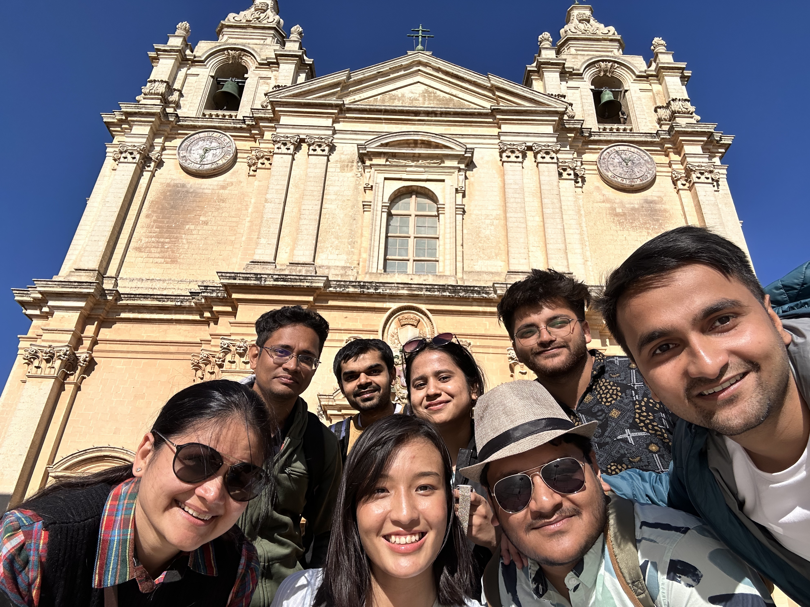
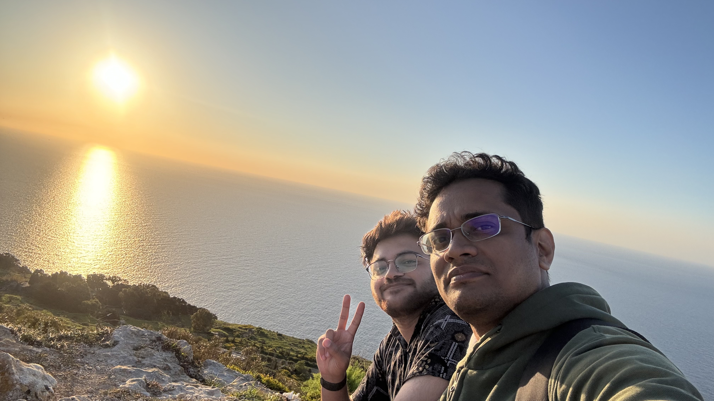

[back](./)

## Events

| | |
|-|-|
|  In Valetta (Malta) with Prachi Jain (Microsoft), Tanmay (Microsoft), Aayush Agrawal (Microsoft), Rishav (Microsoft), Cem (MEU), and Ashutosh (IIT Bombay). |   With Prachi, Tanmay, Aayush, Aditi (Microsoft), Jennifer (CMU), Siddharth (Amazon), and Rohith (ambientone) in Mdina (Malta). |
|  With Tanmay, Siddharth, Jennifer, and Aayush in Mdina (Malta). |  With Rohith Kodali sitting at the edge of Dingli Cliff (Malta). |
|  With PMRF CSE friends at the PMRF Symposium 2024 at IIT Indore. Had a great poster session! :) |  With IIT Jodhpur friends visiting Sarafa Market late night in Indore!  |
|  With PMRF friends after the PMRF Symposium was over! :') |  Bunch of PMRFs with the director of IIT Indore during the morning jungle walk.   |
|  With Prof. Ganti S. Murthy (IIT Indore) and Abhiram (IIT Jodhpur) during the PMRF Symposium 2024 |  Lingo members showcasing their amazing works at the Colab Event 2024 at IIT Gandhinagar.   |
|  Prof. Anirban, Prof. Nipun, Shruti, Jayesh, Zeel, Binita, and Himanshu attended the 'Research Week with Google 2024' at Google Research India, Bangalore, India. |  Was fortunate to meet one of my motivations at Research Week with Google 2024, Prof. Trevor Cohn (Uo Melbourne and Google) himself!   |
|  Met Prof. Mohit Bansal (University of North Carolina at Chapel Hill) while serving as the Publicity Chair for IndoML 2023 at IIT Bombay! 🤯 |  Met Prof. Pawan Goyal (IIT Kharagpur), also one of my grand-advisor at the Research Week with Google in Bangalore!   |
|  Got a selfie with Prof. Richa Singh (IIT Jodhpur) at Research Week w Google 24' |  Went for a quick marathon with some amazing minds from IIT Gandhinagar in GIFT City, Gandhinagar.  |
|  Having a great dinner with amazing folks from the Machine Learning Summer School 2023 in Krakow, Poland! 😀 |  Look who went for an excursion in Krakow (Poland) during the MLSS 23'. Param said, 'Hiiii'! 😆  |
|  Dr. Sayak Ray Chowdhury and I went for an 8 KM hike in Morskie Oko ("Sea Eye"), Poland! 🚶🏻‍♂️ |  Akash Pareek (IIT Gandhinagar) and I went for a cool breeze 😎 during our excursion in Bhopal (India) during the ACM Annual Symposium 2023. |
|  With Prof. Jasabanta Patro (IISER Bhopal) and brilliant students of IISER Bhopal. |  Got a chance to meet Prof. Partha Talukdar (IISc + Google India) at ACM Annual Symposium 2023 in Bhopal (India). |
|  IIT Gandhinagar PhD Students with Prof. PK during the ACM-ARCS 23' event in Bhopal. |  Met Dr. Nitish Gupta (Google Research India) during the Research Week w Google (RWwG) 23' in Bangalore, India.  |
|  A selfie after a great discussion on Model Editing with Prof. Yonatan Belinkov (Technion-IIT) during the RWwG 23' in Bangalore (India). |  Second meeting with Prof. Partha during the RWwG 23'.  |
|  Dr. Pradeep Shenoy (Google) with a bunch of folks from IIT Gandhinagar. |  Met Prof. Preethi Jyoti (IIT Bombay) at RWwG 23'! 😄  |
|  Bumped into Prof. R. Venkatesh Babu (IISc Bangalore) during the RWwG 23' event! |  Had a chance to meet Dr. Steve Blackburn (Google Australia) during the RWwG 23'. |
|  Pritam and I were meeting Prof. Preethi Jyoti during the CODS-COMAD 23'! 😎✨ |  I bumped into Raj Sharma (Walmart) during the CODS-COMAD 23' at IIT Bombay! 🤯 |
|  After a great discussion on ML with Dr. Praneeth Netrapalli (Google Research) at CODS-COMAD 23'. |  With Prof. Sameer Sahasrabudhe (IIT Gandhinagar) at the Language & Tech Summit 23' at Delhi (India). |

---

[back](./)
