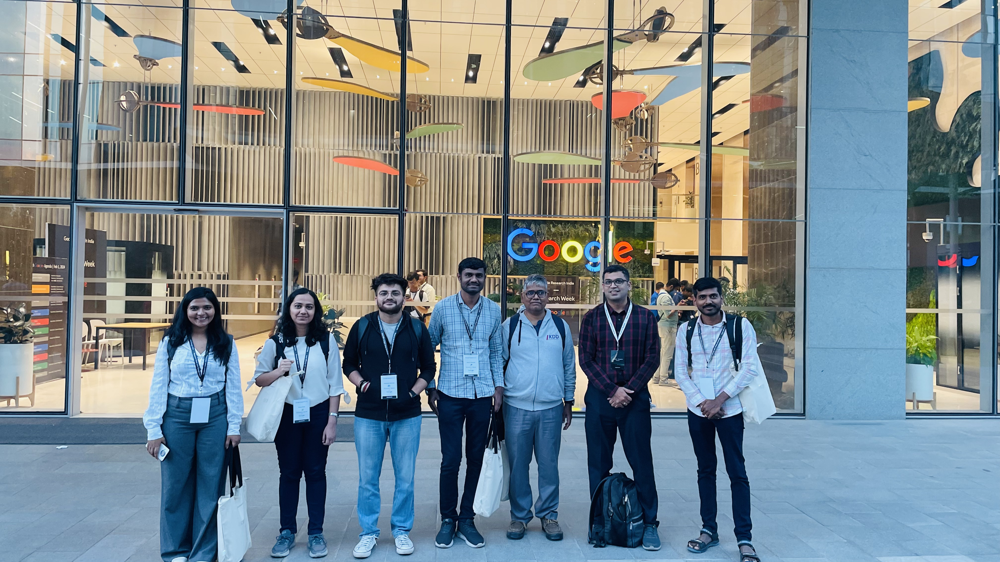
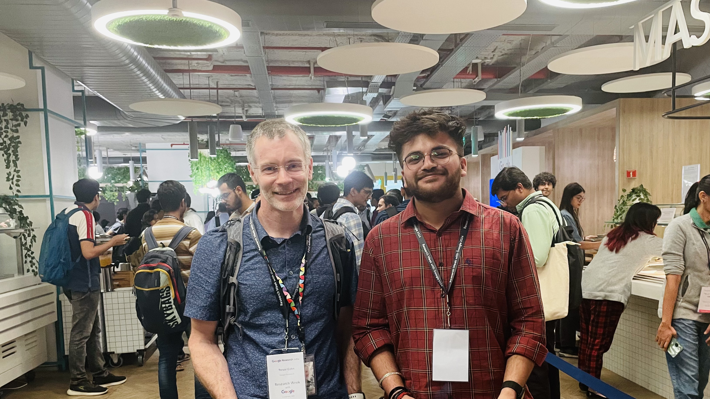

[back](./)

## Events

| | |
|-|-|
|  Made so many friends during the excursion at the Temple in Suzhou, China! 🇨🇳 |  Yummy vegan dinner with [Prof. Mausam](https://www.cse.iitd.ernet.in/~mausam/), [Prof. Akhil Arora](https://www.au.dk/en/akhil.arora@cs.au.dk), and amazing researchers in China 🇨🇳! :')  |
|  During the social time with [Dr. Garima Gaur](https://scholar.google.com/citations?user=thOvLMkAAAAJ&hl=en) and amazing friends at EMNLP '25! |  Had an amazing dance with fabulous people I met during the social night at EMNLP '25!   |
|  Got a selfie with [Prof. Dirk Hovy](https://dirkhovy.com/)!  |  During the Microsoft Research India PhD award announcements with Dr. Srivathsan Koundinyan!   |
|  ALPS 2025 was amazing with the karaoke! |  Had a short trip to Keukonhof in the Netherlands 🇳🇱 with Vaishali! 🌷 |
|  A group photo with amazing people from the ALPS 2025, France 🇫🇷! |  Had an amazing time with [Prof. Dirk Hovy](https://dirkhovy.com/) during ALPS 2025 in Aussois, France! 🇫🇷|
|  During the excursion in Mysore! Held during the ACM PIC 2025! 🇮🇳 |  First ski experience with [Dr. Youngwoo Kim](https://youngwoo-umass.github.io/) in Estes Park, Colorado, USA 🇺🇸! |
|  Presented a poster at the PMRF Symposium at IIT Hyderabad! |  A group photo of participants and speakers at ACM PIC 2025 at Infosys Mysore! |
|  With [Prof. Tom Hartvigsen](https://www.tomhartvigsen.com/) and [Prof. Mohit Bansal](https://www.cs.unc.edu/~mbansal/) at EMNLP '24 in Miami, USA. 🇺🇸 |  Amazing talk with friends about the fishes and sharks! :) |
|  Lunch with Indians @ EMNLP! We had 118+ RSVPs :') |  With [Prof. Yonatan Belinkov](https://belinkov.com/)!, during the social dinner at EMNLP '24. |
|  Sarthak (Apple) and I posing to show Joel that Earth's a small place. :D |  Had amazing time during the BoF dinner at EMNLP '24. |
|  With friends at the iconic Colony Hotel on Miami Beach! |  With amazing people at the Miami Beach! :) |
|  After the gala dinner at EMNLP '24 with Dexter Wang (Meta AI), Antoine (Meta AI), Makesh (Nvidia), and Aleksander (Nvidia). |  With Prof. Monojit Choudhary and Prof. Mausam at EMNLP '24. |
|  During a random walk in Charlottesville with Shreejeet (UVA) and Chaitanya (UVA). |  After a trek with Prof. Tom Hartvigsen and his lab at UVA! In the picture (Left to Right): Mingtian, Youngwoo, Zhanwen, Zack, Karolina, Prof. Tom, Yash, Me, Shivam, and Medhasweta. |
|  After a great discussion with [Dr. Nicola Cancedda](https://ai.meta.com/people/941637921299851/nicola-cancedda/) at Meta's social event at ACL 24'. |  During Bangkok's excursion with Dr. Satya (Meta) at ACL 24'. _(He is an amazing personality and inspiration!!)_ |
|  With Prof. Christopher Manning at ACL 24' (Bangkok, Thailand)!! _(Yes, Prof. Manning!!!)_ |  Met Prof. Monojit Choudhury at ACL 24' in Bangkok (Thailand)! _(Every meeting with him motivates me to DO real research!!!)_ |
|  A cool visit with Mark and Dasha at Chinatown (Bangkok) during the ACL 24'. |  Friends from ACL 24' (Left to Right): Kinshuk (IISc), Navreet (IISc), Mansi (Google), Me, Gurpreet (KTH :D), Megh (Mila), Sumanth (IIT Madras), Harman (Google), and Tushar (ASTAR). |
|  With all members of LINGO Labs before leaving for ACL 24' and visiting internship at UVA. |  Friends from ACL 24' (Left to Right): Tushar (ASTAR, Singapore), Me, Mansi (Google), Prof. Danish (IISc), Navreet (IISc), and Kinshuk (IISc). |
|  With Dr. Srivathsan Koundinyan, Prof. Amit Prashant, and Prof. Mayank Singh at the ACM Summer School 2024 at IIT Gandhinagar. |  A late night walk with Prof. Pushpak Bhattacharya (IIT Bombay) during the ACM Summer School 24'. |
|  In Valetta (Malta) with Prachi Jain (Microsoft), Tanmay (Microsoft), Aayush Agrawal (Microsoft), Rishav (Microsoft), Cem (MEU), and Ashutosh (IIT Bombay). |   With Prachi, Tanmay, Aayush, Aditi (Microsoft), Jennifer (CMU), Siddharth (Amazon), and Rohith (ambientone) in Mdina (Malta). |
|  With Tanmay, Siddharth, Jennifer, and Aayush in Mdina (Malta). |  With Rohith Kodali sitting at the edge of Dingli Cliff (Malta). |
|  With PMRF CSE friends at the PMRF Symposium 2024 at IIT Indore. Had a great poster session! :) |  With IIT Jodhpur friends visiting Sarafa Market late night in Indore!  |
|  With PMRF friends after the PMRF Symposium was over! :') |  Bunch of PMRFs with the director of IIT Indore during the morning jungle walk.   |
|  With Prof. Ganti S. Murthy (IIT Indore) and Abhiram (IIT Jodhpur) during the PMRF Symposium 2024 |  Lingo members showcasing their amazing works at the Colab Event 2024 at IIT Gandhinagar.   |
|  Prof. Anirban, Prof. Nipun, Shruti, Jayesh, Zeel, Binita, and Himanshu attended the 'Research Week with Google 2024' at Google Research India, Bangalore, India. |  Was fortunate to meet one of my motivations at Research Week with Google 2024, Prof. Trevor Cohn (Uo Melbourne and Google) himself!   |
|  Met Prof. Mohit Bansal (University of North Carolina at Chapel Hill) while serving as the Publicity Chair for IndoML 2023 at IIT Bombay! 🤯 |  Met Prof. Pawan Goyal (IIT Kharagpur), also one of my grand-advisor at the Research Week with Google in Bangalore!   |
|  Got a selfie with Prof. Richa Singh (IIT Jodhpur) at Research Week w Google 24' |  Went for a quick marathon with some amazing minds from IIT Gandhinagar in GIFT City, Gandhinagar.  |
|  Having a great dinner with amazing folks from the Machine Learning Summer School 2023 in Krakow, Poland! 😀 |  Look who went for an excursion in Krakow (Poland) during the MLSS 23'. Param said, 'Hiiii'! 😆  |
|  Dr. Sayak Ray Chowdhury and I went for an 8 KM hike in Morskie Oko ("Sea Eye"), Poland! 🚶🏻‍♂️ |  Akash Pareek (IIT Gandhinagar) and I went for a cool breeze 😎 during our excursion in Bhopal (India) during the ACM Annual Symposium 2023. |
|  With Prof. Jasabanta Patro (IISER Bhopal) and brilliant students of IISER Bhopal. |  Got a chance to meet Prof. Partha Talukdar (IISc + Google India) at ACM Annual Symposium 2023 in Bhopal (India). |
|  IIT Gandhinagar PhD Students with Prof. PK during the ACM-ARCS 23' event in Bhopal. |  Met Dr. Nitish Gupta (Google Research India) during the Research Week w Google (RWwG) 23' in Bangalore, India.  |
|  A selfie after a great discussion on Model Editing with Prof. Yonatan Belinkov (Technion-IIT) during the RWwG 23' in Bangalore (India). |  Second meeting with Prof. Partha during the RWwG 23'.  |
|  Dr. Pradeep Shenoy (Google) with a bunch of folks from IIT Gandhinagar. |  Met Prof. Preethi Jyoti (IIT Bombay) at RWwG 23'! 😄  |
|  Bumped into Prof. R. Venkatesh Babu (IISc Bangalore) during the RWwG 23' event! |  Had a chance to meet Dr. Steve Blackburn (Google Australia) during the RWwG 23'. |
|  Pritam and I were meeting Prof. Preethi Jyoti during the CODS-COMAD 23'! 😎✨ |  I bumped into Raj Sharma (Walmart) during the CODS-COMAD 23' at IIT Bombay! 🤯 |
|  After a great discussion on ML with Dr. Praneeth Netrapalli (Google Research) at CODS-COMAD 23'. |  With Prof. Sameer Sahasrabudhe (IIT Gandhinagar) at the Language & Tech Summit 23' at Delhi (India). |

---

[back](./)
